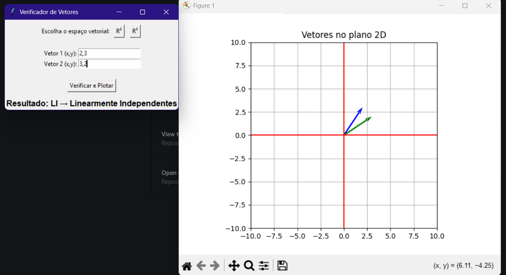

# 🔢 Verificador de Vetores — LI ou LD com Gráficos 2D/3D

Este projeto permite verificar se um conjunto de vetores é **linearmente independente (LI)** ou **linearmente dependente (LD)**, além de **plotar graficamente** os vetores em 2D ou 3D.

--- 

## 📌 Funcionalidades

- Verifica se os vetores são LI ou LD usando o posto da matriz.
- Interface gráfica com **Tkinter** para facilitar o uso.
- Visualização em:
  - 📈 2D (R²)
  - 🧊 3D (R³)
- Gráfico com vetores coloridos e eixos personalizados.

---

## 📷 Interface R2


## 📷 Interface R3


---

## 🚀 Tecnologias Utilizadas

- [Python 3](https://www.python.org/)
- [Tkinter](https://docs.python.org/3/library/tkinter.html) – Interface gráfica
- [NumPy](https://numpy.org/) – Cálculo de posto da matriz
- [Matplotlib](https://matplotlib.org/) – Gráfico dos vetores

---

## 📦 Instalação

1. **Clone o repositório:**

```bash
git clone https://github.com/seu-usuario/verificador-vetores.git
cd verificador-vetores
```
2. **Instale as dependências:**
```bash
pip install matplotlib numpy
```

---

## 🧠 Como Usar
1. Execute o script da interface:
```bash
python Verificador_li_ld_r2_r3.py
```
2. Na janela que abrir:
  - Clique em R² ou R³.
  - Digite os vetores nos campos:
    ```
    1,2
    ou
    3,4,5
    ```
  - Clique em "Verificar e Plotar".
3. O resultado será exibido na tela, junto com o gráfico gerado automaticamente.

---

### Desenvolvido por Noah Franco.
Contribuições, sugestões ou melhorias são bem-vindas!


